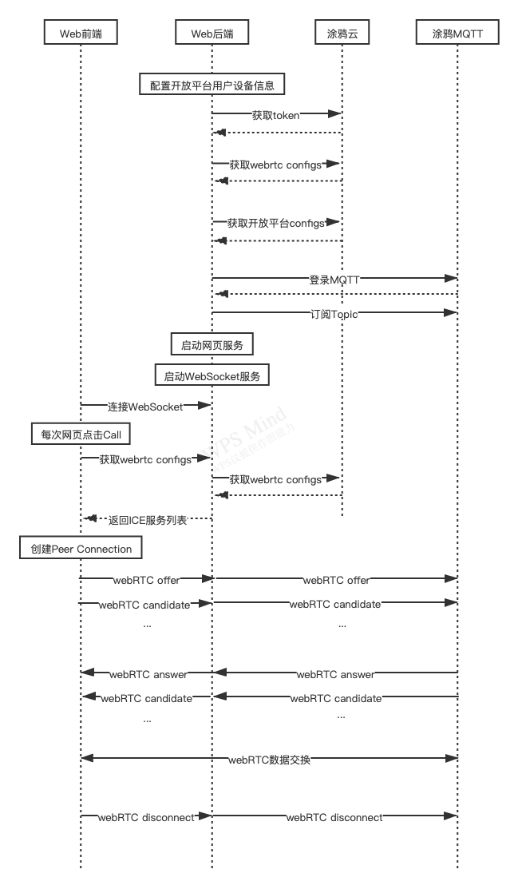

# Tuya WebRTC Web Sample接入文档

## Модульный состав
### Веб-интерфейс
* Предоставляет страницу для доступа Chrome для просмотра прямых трансляций webRTC устройства.
* Общайтесь с веб-сервером через протокол WebSocket.
* Вызов API Javascript для создания предложения и кандидата webRTC

### веб-сервер
* хостинг веб-страниц
* Получите доступ к Tuya Cloud и получите различную информацию о конфигурации, необходимую через протокол HTTP.
* Подключить сервис Tuya MQTT,

### облако граффити
* Обеспечьте открытую платформу различными HTTP-интерфейсами

### Туя MQTT
* Обеспечить асинхронный канал передачи данных

## Step By Step
1. Регистрация [Открытая платформа Туя](https://docs.tuya.com/zh/iot/open-api/quick-start/quick-start1?id=K95ztz9u9t89n),Получать`clientId` а также`secret`

2. Образец обновления webrtc.json нейтральный`clientId`а также`secret`

3. Доступ к [Авторизация открытой платформы Tuya](https://openapi.tuyacn.com/selectAuth?client_id=kydhkuwwehqrvd8pfpv5&redirect_uri=https://www.example.com/auth&state=1234)，Введите пароль учетной записи Tuya, согласитесь на авторизацию и перехватите код авторизации в URL-адресе обратного вызова браузера.`code`

4. Обновите образец webrtc.json в `code`

5. Выберите IP-камеру в приложении Tuya Smart APP, запросите идентификатор устройства и обновите его до образца webrtc.json.`deviceId`

6. В исходном пути образца выполните `go get` после казни `go build`

7. бежать `./webrtc-web-sample`

8. Chrome открывается `http://localhost:3333`, нажмите `Call` кнопка для начала сеанса WebRTC

## Q&A
1. После получения конфигов открытой платформы вам необходимо `result.source_topic.ipc`в поле JSON`/av/u/`Последняя строка используется как исходная в заголовке MQTT, чтобы правильно получать сообщения от службы Tuya MQTT.